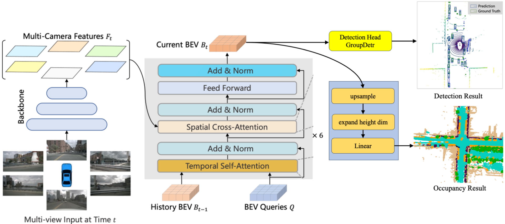

<div align="center">

<!-- omit in toc -->
# Apollo Vision Net
This repository introduces the Apollo Vision Network, a new 3D detection and occupancy prediction network for autonomous driving.
## Overview



- We feed multi-camera images to the backbone network, and obtain the features of diffetrent camera views.
- Use Transformer encoder to generate the bev features.
  - The encoder layer contains grid-shaped BEV queries, temporal self-attention, and spatial cross-attention.
  - In spatial cross- attention, each BEV query only interacts with image features in the regions of interest. 
  - In temporal self-attention, each BEV query interacts with two features: the BEV queries at the current timestamp and the BEV features at the previous timestamp.
- Taking the BEV features as input, the multi-task head predicts the preception results.
  - The 3D detection head predicts the 3D bounding box and the class probability like BEVFormer.
  - The occupancy head first upsamples the BEV features to original resolution and then use linear layer to predict the occupancy probability of each voxel.

## Highlights

Our Apollo vision Net proposes several works as follows, significantly improving the performance of 3D detection and occupancy prediction.
- Image backbone: Replacing ResNet-50 with pre-trained DLA-34 using depth estimation data (Toyota DDAD15M) reduces model complexity while improving performance.
- Image neck: Replacing the single scale FPN network with a SecondFPN network improves the performance of the model.
- Detection head: Using GroupDETR instead of DETR significantly improves object detection performance without increasing time consumption.
- Occ head: Using low resolution bev queries (50 * 50) in the Transformer encoder, then upsampling to high resolution (200 * 200) in the occ head, significantly improve inference speed.
- OCC loss: Increase the weight of OCC focal loss from 1.0 to 10.0, introduce affinity loss and lovasz softmax loss, and significantly improve the miou of OCC detection.

# Getting Started
- [Install](docs/install.md)
- [Prepare dataset](docs/prepare_dataset.md)
- [Visualization](docs/visualization.md)
- [Run the code](docs/run.md)

# Install
- [Apollo Doc](https://apollo.baidu.com/docs/apollo/latest/md_docs_2_xE5_xBA_x94_xE7_x94_xA8_xE5_xAE_x9E_xE8_xB7_xB5_2_xE5_xBC_x80_xE5_x8F_x91_xE8_xB0_x83_5caf853ed6f358d869281b4223669771.html)

```
conda create -n occ python=3.8 -y
conda activate occ
conda install pytorch==1.10.0 torchvision==0.11.0 torchaudio==0.10.0 cudatoolkit=10.2 -c pytorch
pip install mmcv-full==1.4.1
pip install mmdet==2.19.0
pip install mmsegmentation==0.20.0
git clone https://github.com/ApolloAuto/Apollo-Vision-Net
cd Apollo-Vision-Net
pip install -r requirements.txt
git clone https://github.com/open-mmlab/mmdetection3d.git
cd mmdetection3d
git checkout v0.18.1 # Other versions may not be compatible.
python setup.py develop
pip install timm
```

# Results and Pre-trained Models

| Methods | 3d detection mAP | occupancy miou |
| -- | -- |-- |
| bevformer-tiny (2022 ECCV) | 25.2% |- |
|  | - | 19.48% |
| Apollo-vision-Net (Ours) |  31.94% ($ \uparrow $ 6.74%) | 21.87% ($ \uparrow $ 2.39%)|

# Related resources
- [BEVFormer](https://github.com/fundamentalvision/BEVFormer)
- [BEV Perception Survey & Recipe](https://github.com/OpenDriveLab/BEVPerception-Survey-Recipe)
- [OccNet](https://github.com/OpenDriveLab/OccNet/tree/occnet?tab=readme-ov-file)
